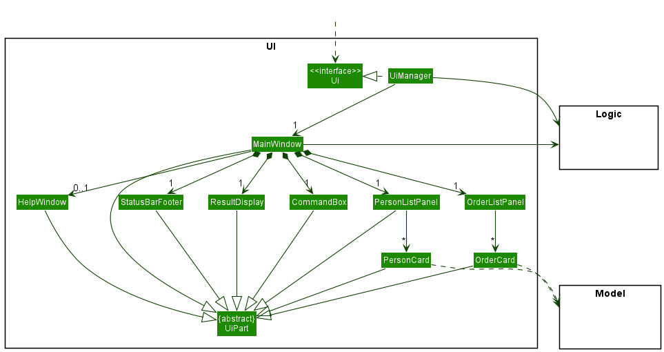
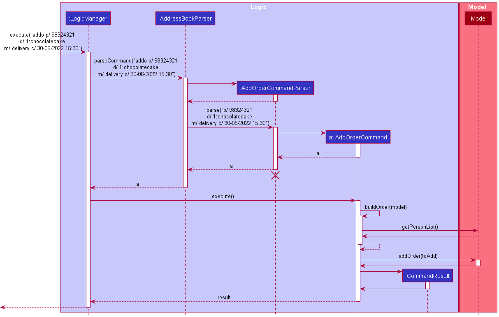
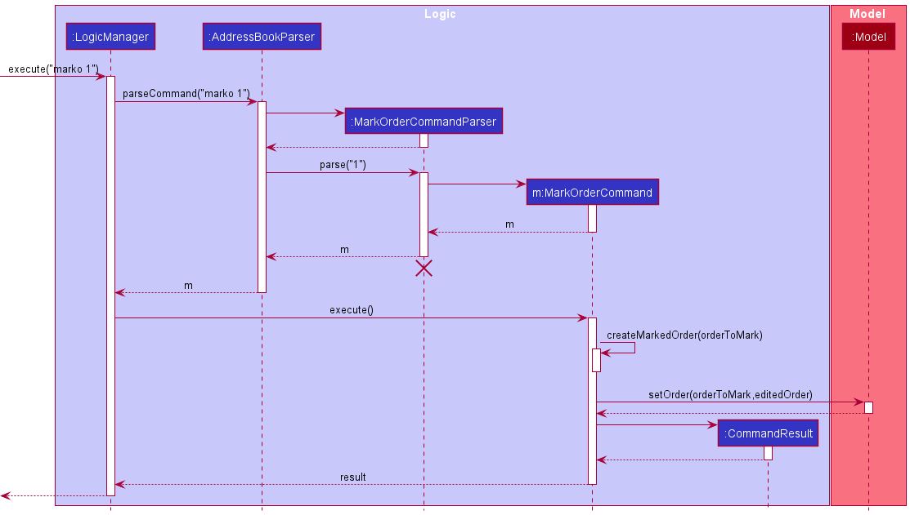
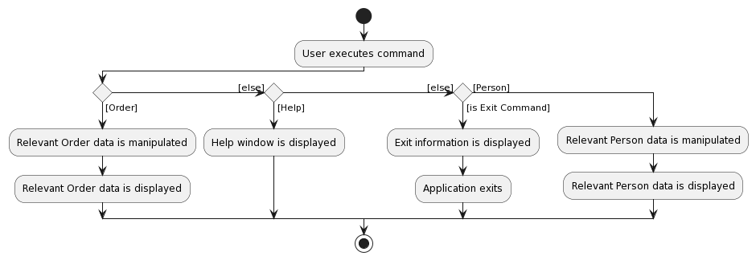
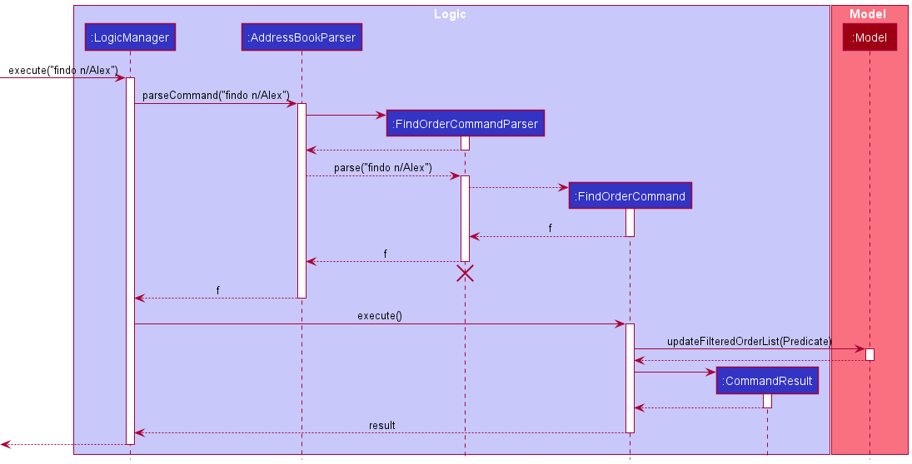
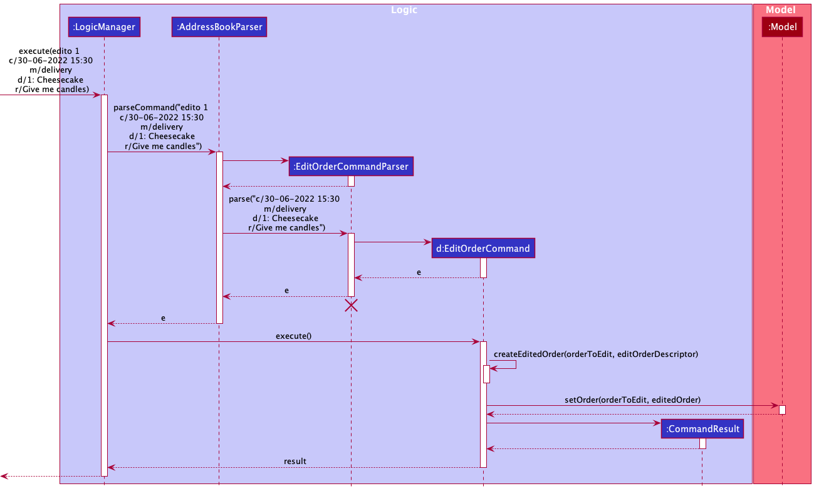
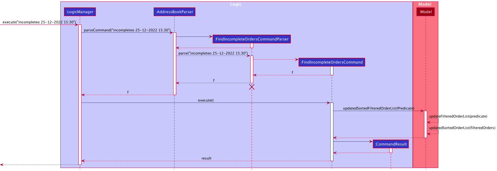
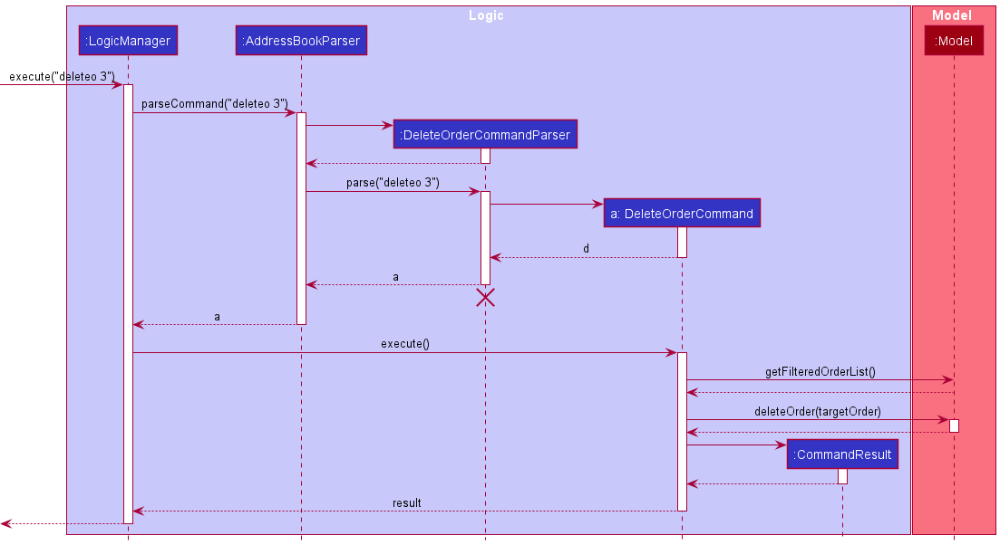

# Table of Contents
1. [Acknowledgements](#acknowledgements)
2. [Setting Up](#setting-up)
3. [Design](#design)
4. [Implementation](#implementation)
5. [Documentation, logging, testing, configuration, dev-ops](#additional-information)
6. [Appendix: Requirements](#requirements)

--------------------------------------------------------------------------------------------------------------------

## **Acknowledgements** 

* Geralddtan - Reused Leap Year Checker (DeliveryDateTime#isLeapYear) from https://www.geeksforgeeks.org/java-program-to-find-if-a-given-year-is-a-leap-year/
* Punnyhuimin - Reused natural date checker formula (DateChecker#naturalDateCheck()) from https://coderanch.
  com/t/385117/java/date-Monday
* Punnyhuimin - Reused scroll bar CSS https://stackoverflow.com/questions/48048943/javafx-8-scroll-bar-css
* {list here sources of all reused/adapted ideas, code, documentation, and third-party libraries -- include links to the original source as well}

--------------------------------------------------------------------------------------------------------------------

## **Setting up, getting started** 

Refer to the guide [_Setting up and getting started_](SettingUp.md).

--------------------------------------------------------------------------------------------------------------------

## **Design** 

:bulb: **Tip:** The `.puml` files used to create diagrams in this document can be found in the [diagrams](https://github.com/se-edu/addressbook-level3/tree/master/docs/diagrams/) folder. Refer to the [_PlantUML Tutorial_ at se-edu/guides](https://se-education.org/guides/tutorials/plantUml.html) to learn how to create and edit diagrams.

### Architecture

The ***Architecture Diagram*** given above explains the high-level design of the App.

Given below is a quick overview of main components and how they interact with each other.

**Main components of the architecture**

**`Main`** has two classes called [`Main`](https://github.com/se-edu/addressbook-level3/tree/master/src/main/java/seedu/address/Main.java) and [`MainApp`](https://github.com/se-edu/addressbook-level3/tree/master/src/main/java/seedu/address/MainApp.java). It is responsible for,
* At app launch: Initializes the components in the correct sequence, and connects them up with each other.
* At shut down: Shuts down the components and invokes cleanup methods where necessary.

[**`Commons`**](#common-classes) represents a collection of classes used by multiple other components.

The rest of the App consists of four components.

* [**`UI`**](#ui-component): The UI of the App.
* [**`Logic`**](#logic-component): The command executor.
* [**`Model`**](#model-component): Holds the data of the App in memory.
* [**`Storage`**](#storage-component): Reads data from, and writes data to, the hard disk.

**How the architecture components interact with each other**

The *Sequence Diagram* below shows how the components interact with each other for the scenario where the user issues the command `deletep 1`.

Each of the four main components (also shown in the diagram above),

* defines its *API* in an `interface` with the same name as the Component.
* implements its functionality using a concrete `{Component Name}Manager` class (which follows the corresponding API `interface` mentioned in the previous point.

For example, the `Logic` component defines its API in the `Logic.java` interface and implements its functionality using the `LogicManager.java` class which follows the `Logic` interface. Other components interact with a given component through its interface rather than the concrete class (reason: to prevent outside component's being coupled to the implementation of a component), as illustrated in the (partial) class diagram below.

The sections below give more details of each component.

### UI component

The **API** of this component is specified in [`Ui.java`](https://github.com/se-edu/addressbook-level3/tree/master/src/main/java/seedu/address/ui/Ui.java)

The UI consists of a `MainWindow` that is made up of parts e.g.`CommandBox`, `ResultDisplay`, `PersonListPanel`,`OrderListPanel`, `StatusBarFooter` etc. All these, including the `MainWindow`, inherit from the abstract `UiPart` class which captures the commonalities between classes that represent parts of the visible GUI.

The `UI` component uses the JavaFx UI framework. The layout of these UI parts are defined in matching `.fxml` files that are in the `src/main/resources/view` folder. For example, the layout of the [`MainWindow`](https://github.com/se-edu/addressbook-level3/tree/master/src/main/java/seedu/address/ui/MainWindow.java) is specified in [`MainWindow.fxml`](https://github.com/se-edu/addressbook-level3/tree/master/src/main/resources/view/MainWindow.fxml)

The `UI` component,

* executes user commands using the `Logic` component.
* listens for changes to `Model` data so that the UI can be updated with the modified data.
* keeps a reference to the `Logic` component, because the `UI` relies on the `Logic` to execute commands.
* depends on some classes in the `Model` component, as it displays `Person` and `Order` objects residing in the `Model`.

### Logic component

**API** : [`Logic.java`](https://github.com/se-edu/addressbook-level3/tree/master/src/main/java/seedu/address/logic/Logic.java)

Here's a (partial) class diagram of the `Logic` component:

How the `Logic` component works:
1. When `Logic` is called upon to execute a command, it uses the `AddressBookParser` class to parse the user command.
1. This results in a `Command` object (more precisely, an object of one of its subclasses e.g., `AddPersonCommand`) which is executed by the `LogicManager`.
1. The command can communicate with the `Model` when it is executed (e.g. to add a person).
1. The result of the command execution is encapsulated as a `CommandResult` object which is returned back from `Logic`.

The Sequence Diagram below illustrates the interactions within the `Logic` component for the `execute("delete 1")` API call.

:information_source: **Note:** The lifeline for `DeleteCommandParser` should end at the destroy marker (X) but due to a limitation of PlantUML, the lifeline reaches the end of diagram.

Here are the other classes in `Logic` (omitted from the class diagram above) that are used for parsing a user command:

How the parsing works:
* When called upon to parse a user command, the `AddressBookParser` class creates an `XYZCommandParser` (`XYZ` is a placeholder for the specific command name e.g., `AddPersonCommandParser`) which uses the other classes shown above to parse the user command and create a `XYZCommand` object (e.g., `AddPersonCommand`) which the `AddressBookParser` returns back as a `Command` object.
* All `XYZCommandParser` classes (e.g., `AddPersonCommandParser`, `DeletePersonCommandParser`, ...) inherit from the `Parser` interface so that they can be treated similarly where possible e.g, during testing.

### Model component
**API** : [`Model.java`](https://github.com/AY2122S2-CS2103-F09-4/tp/blob/master/src/main/java/seedu/address/model/Model.java)

The `Model` component,

* stores the address book data i.e., all `Person` and `Order` objects (which are contained in a `UniquePersonList` object and a `UniqueOrderList` object).
* stores the currently 'selected' `Person` objects (e.g., results of a search query) as a separate _filtered_ list which is exposed to outsiders as an unmodifiable `ObservableList<Person>` that can be 'observed' e.g. the UI can be bound to this list so that the UI automatically updates when the data in the list change.
* stores the currently 'selected' `Order` objects (e.g., results of a search query) as a separate _filtered_ list which is exposed to outsiders as an unmodifiable `ObservableList<Order>` that can be 'observed' e.g. the UI can be bound to this list so that the UI automatically updates when the data in the list change.
* stores a `UserPref` object that represents the user’s preferences. This is exposed to the outside as a `ReadOnlyUserPref` objects.
* does not depend on any of the other three components (as the `Model` represents data entities of the domain, they should make sense on their own without depending on other components)

:information_source: **Note:** An alternative (arguably, a more OOP) model is given below. It has a `Tag` list in the `AddressBook`, which `Person` references. This allows `AddressBook` to only require one `Tag` object per unique tag, instead of each `Person` needing their own `Tag` objects. 

### Storage component

**API** : [`Storage.java`](https://github.com/AY2122S2-CS2103-F09-4/tp/blob/master/src/main/java/seedu/address/storage/Storage.java)

The `Storage` component,
* can save both ReadyBakey data and user preference data in json format, and read them back into corresponding objects.
* inherits from both `AddressBookStorage` and `UserPrefStorage`, which means it can be treated as either one (if only the functionality of only one is needed).
* depends on some classes in the `Model` component (because the `Storage` component's job is to save/retrieve objects that belong to the `Model`)

### Common classes

Classes used by multiple components are in the `seedu.address.commons` package.

--------------------------------------------------------------------------------------------------------------------

## **Implementation** 

This section describes some noteworthy details on how certain features are implemented.

### Adding Orders Feature

This feature allows users to add orders.

#### Implementation

The AddOrder feature uses the command `addo`. It extends the abstract class `Command`.
The AddOrder feature takes in 4 required parameter and 1 optional parameter.

| Prefix | Meaning                | Example               | Format                                                        | Compulsory |
|--------|------------------------|-----------------------|---------------------------------------------------------------|------------|
| /p     | Phone Number           | /p 90124322           | Must be a number longer than 3 digits                         | Yes        |
| /c     | Delivery Date and Time | /c 30-06-2022 15:30   | Must follow the format dd-MM-yyyy HH:mm                       | Yes        |
| /m     | Collection Type        | /g delivery           | Must be either `delivery` or `pickup` with any capitalisation | Yes        |
| /d     | Details of Order       | /d 1:Chocolate Cake   | Can take in any detail of the order                           | Yes        |
| /r     | Remark                 | /r Put more Chocolate | Can take in any remark of the order                           | No         |

When the add order command is executed by calling `AddOrderCommand#execute`, the order is built with the
respective phone number, delivery date time, collection type, details and remarks specific to that order. This is
performed in the function `AddOrderCommand#buildOrder`.

All inputs by users go through an `AddOrderCommandParser` which extracts out the relevant details for each prefix in the
method `AddOrderCommandParser#parse`. This method handles the checking of whether the input by the user is valid.

There are 3 main forms of invalid input by the user that is checked for:
1. When any of the compulsory fields are not specified in the creation of an order
2. Any field does not fulfil the provided format
3. The length of a field is not within the allowed range

When an invalid input is parsed, a `ParseException` is thrown and the user will be shown a message on the proper
usage of the add order command.

The following sequence diagram illustrates how the `AddOrderCommand` works:

#### Design Considerations

1) Phone Number stores any number longer than 3 digits long and less than 15 digits long
   * This format was chosen to be more flexible to accept different length of numbers
   * Phone number needs to already exist in a `Person` so that there is a linkage made
2) Delivery Date and Time takes in user input in the format dd-MM-yyyy HH:mm, as well as natural date formats E.g. `Mon 12:59`
   * This user input format was chosen to be user-friendly
   * This Date and Time is represented to the user in the format such as "Thursday, 30 Jun 2022, 03:30PM"
     * This was chosen to be a very readible date and time format
3) Collection Type is an enum with types `DELIVERY` or `PICKUP`
   * Enum was chosen to keep this representation more flexible and easily readable
   * Alternative:
     * Using a Boolean value to represent delivery vs pickup
       * This was not chosen to increase the flexibility and extensibility of the code
4) Remark was left to be of open format to give the user flexibility in describing the orders
   * There is a maximum character limit imposed of 70 due to UI considerations
5) Details has to be given in the format `NumberOfItems:NameofItem` E.g. `1:ChocolateCake`
   * There is a maximum character limit imposed of 30 for the name of the item  due to UI considerations
   * The number of items has to be in the range of 1 - 99
   

### Mark/Unmark Feature

This feature allows users to mark the orders as complete/incomplete.

#### Implementation

The mark feature consists of two commands, `MarkOrderCommand` and `UnmarkOrderCommand`.
Both of the commands extend `Command`. An `Index` parameter is needed to indicate the
targeted order. 

When the commands are executed by calling `Command#execute(Model model)`, the Order
that is indicated by the `Index`, will have its attribute `Complete` updated to have
an appropriate boolean value. This is done by calling `model#setOrder(Order target, Order editedOrder)` which replaces the existing order with editedOrder
to ensure that `Order` is immutable.

When an invalid input is parsed, a `CommandException` will be thrown and the user will be shown a
message on the proper usage of the command.

The following sequence diagram illustrates how the `MarkCommand` works:

Similar concept applies for `UnmarkOrderCommand`.

#### Design consideration

1) `Complete` stores a boolean value.
   * Boolean value was chosen to keep the implementation simple.
   * Alternative: Store an Enum containing possible values of `Complete`
     * Pros: More easily readable.
     * Cons: Larger implementation.
   * Boolean chosen due to simple implementation.
   * Completion status of an order can only take 2 values, an order can be complete or incomplete, thus there is no need for an Enum class.

2) Order is still immutable
   * Creating a marked order will duplicate the current order, while changing the `Complete` attribute
   * Then, the current order will be replaced with the new order in order to maintain immutability.

### Dynamic Toggling Between Application's Data
#### Implementation
Users must be able to view the specific data that they need, without excess data, just by working with the command line. For example, if the user is requesting Order information, they should not be distracted by Person information as well - only Order information can be shown.

The ability to toggle through the application's data  is facilitated by `MainWindow` and `CommandResult`.

In `MainWindow#executeCommand(String commandText)`, the type of `CommandResult` of the executed command is checked and the `MainWindow` then displays the appropriate information for the user.

#### Design considerations:
1. `CommandResult` requires boolean attributes that indicate what kind of command has been executed.
    * isOrderCommand - boolean  indicating whether the command is related to orders
    * isPersonCommand - boolean  indicating whether the command is related to persons
    * isHelpCommand - boolean indicating whether the command is related to getting help
    * isExitCommand - boolean indicating whether the command is to exit the application

The following activity diagram summarizes what happens when a user executes the different types of commands:

### Finding Persons and Orders Through Selected Attribute
#### Implementation
Users are able to find specific persons/orders based on their respective attributes. For example, users can find orders that are made by a Person with name "Alex".

The search is based on (case-insensitive) words matching the keyword input. Both `findo` and `findp` work similarly, only differing in the attributes supported for find.   

Supported attributes for `findp`: name, phone, email, address, remark. 
Supported attributes for `findo`: name, phone, details, collection_type, remark.

#### Design considerations:

The parsing of searchable attributes and as well as the keywords (to find for) is currently done with `ArgumentTokenizer.tokenize()` method. This is for congruency with parsing methods in `AddOrderCommandParser`, `EditOrderCommandParser` etc.

The method will return a `HashMap<String, String>`. As `HashMap` is an unordered structure, filtering on multiple attributes in a single command potentially results in undeterministic results.

* **Alternative 1 (current choice):** `findo` and `findp` will only support filter for one attribute in a single command 
  * Filtering for multiple attributes in a single command will result in an error eg `findo n/Alex p/98742313`.
  * Adding an attribute to search for, that is not supported, will simply be ignored. For example, adding `details` to search for `findo n/Alex d/chococake` will only return search results that is the same as `findo n/Alex`.
* **Alternative 2:** Implement an alternative form of tokenization to return `LinkedHashMap<String, String>`, which is based on insertion order of attributes and keywords.
  * Filtering for multiple attributes will be possible. For example
  * However, this will require more man-hours and testing to ensure consistent results, and hence is deprioritised. 

For example in `findo`:

1. Create `Predicate` for findable attribute.
   * Find (filter) is based on whether the attribute for Order contains the given keyword (case-insensitive)
2. `FindOrder<Attribute>Command` is then instantiated, which would then find for `Order` that matches the `Predicate`.

The following sequence diagram shows how the `findo` operation works:

### \[In Progress\] Edit Order Feature

This feature allows users to edit the details, collection/ delivery time, whether an order is for delivery or pickup,
and remarks of the order that already exists in ReadyBakey. Currently, it can only edit the details of the order.

### Implementation

The edit orders feature consists of one command, `EditOrderCommand`. It extends `Command`.

These are the inputs that the edit order command will accept:

1) It takes in an `Index` parameter to indicate the order that is to be edited.
2) It also takes in other optional inputs based on the prefixes specified:

| Prefix | Meaning                              | Example            | Format                                                                   | Compulsory |
|--------|--------------------------------------|--------------------|--------------------------------------------------------------------------|------------|
| c/     | Collection/ delivery time            | c/30-06-2022 15:30 | Must follow the format dd-MM-yyyy HH:mm                                  | No         |
| m/     | Collection type (Pickup or Delivery) | m/delivery         | Must be either `delivery` or `pickup` with any capitalisation            | No         |
| d/     | Order Details                        | d/1x Cheesecake    | \[To be implemented\] Must be in the form [NUM_ORDERS\] x \[ANY_STRING\] | No         |
| r/     | Order Remarks                        | r/Give me candles  | Can take in any remark for the order                                     | No         |

At least one of the prefixes needs to be specified to be edited.

When the edit order command is executed by calling the `Command#execute()`, the Order indicated by the `Index`, will
have its order edited, depending on the prefixes that were specified. A new order with the respective details,
collection/ delivery time, whether an order is for delivery or pickup, and remarks of the order, will be created. This
is performed by the function `EditOrderCommand#createEditedOrder()`.

All inputs are parsed through an EditOrderCommandParser, which parses each prefix and extracts the relevant information
for each prefix. This is done in the method `EditOrderCommandParser#parse()`. It also does checks on the validity of the
user input.

There are two parts to the input that will be checked for validity:

1) When an invalid index is provided, a `CommandException` is thrown and the user will be told that the order index they
   have provided is invalid.
2) When there are no prefixes provided, a `ParseException` is thrown and the user is shown a message to provide at
   least one field to edit.
3) When an invalid input is parsed, a `ParseException` is thrown and the user is shown a message on the proper usage of
   the edit order command.

The following sequence diagram illustrates how the `EditOrderCommand` will work:

#### Design considerations
1) Delivery date and time being parsed in should allow the usage of natural dates such as `Thursday 3pm` or `Monday
   4pm` and ReadyBakey will know the date being parsed is the next nearest Thursday at 3pm. This is alongside the
   parsing of date and time in the format `dd-MM-yyyy HH:mm`.
    - This provides bakers with better ability to key in dates without having to stick to only keying in the full
      date and time format.
2) Editing should not be allowed for the completion of the order. It should be done with the use of mark or unmark
   orders instead.
3) The person's details cannot be edited through this command.

## Find Incomplete Orders Before A Date Feature

This feature allows users to get a list of incomplete orders, sorted by datetime, for quick reference to orders that require attention.

### Implementation
The `incompleteo` command takes in a date as a required parameter.

When the command is executed, all orders that are incomplete and before or during the given datetime will be filtered out 
through the use of a predicate. This would return out a `FilteredList` of the desired incomplete orders.

From here, the orders in the `FilteredList` are wrapped in a `SortedList` sorted according to their datetimes with the use of a `orderDateComparator`. This returns a `SortedList`, which is finally
returned back to the `LogicManager`.

The following sequence diagram illustrates how the `incompleteo` command will work:

#### Design considerations
1. The predicate being used to filter the orders contains checks for both incomplete order status and delivery datetime being before or during the given date. 
Alternatively, these 2 conditions could have been set up as a predicate each, which would potentially allow for easier reuse in future commands
that might require just a incomplete order status predicate, or just a date checking predicate. However, it seemed challenging to chain 2 predicates sequentially,
and so this idea was abandoned due to time constraints. It was far more efficient to simply create 1 predicate that checked for both conditions.
2. The sorting functionality introduced a `SortedList` alongside `FilteredList` as a return type. This meant needing to refer to
a common interface, `ObservableList`, wherever either were expected in the `LogicManager`.

### Delete orders 

This feature allows the user to delete orders from the application based on the index on the displayed list in the application.

### Implementation

Deleting orders from the application will not affect persons in the application. This is as an Order is linked to a Person through the same phone number, which allows the Order to retrieve the same name, phone number and address.

The following sequence diagram shows how the `deleteo` operation works:

--------------------------------------------------------------------------------------------------------------------

## **Documentation, logging, testing, configuration, dev-ops** 

* [Documentation guide](Documentation.md)
* [Testing guide](Testing.md)
* [Logging guide](Logging.md)
* [Configuration guide](Configuration.md)
* [DevOps guide](DevOps.md)

--------------------------------------------------------------------------------------------------------------------

## **Appendix: Requirements** 

### Product scope

**Target user profile**:

* tech-savvy small bakery or home bakery owners
* needs to track their customers and orders in a central application
* needs to track details of the cake orders (e.g. Delivery or pickup, cakes ordered)
* prefer CLI desktop apps over other types
* enjoys typing instead of mouse interaction

**Value proposition**:

Handling multiple orders and inventory leads to a time sink. Having a central system management process allows bakers to
focus on what's important -- _baking_. 
* The application organises cake orders for its fulfilment. 
* It also acts as a centralised and structured schedule manager, tracking an individuals' baking inventory needs.

### User stories

Priorities: High (must have) - `* * *`, Medium (nice to have) - `* *`, Low (unlikely to have) - `*`

| Priority | As a …​                                     | I want to …​                                                                            | So that I can…​                                                                         |
|----------|---------------------------------------------|-----------------------------------------------------------------------------------------|-----------------------------------------------------------------------------------------|
| `* * *`  | new user                                    | see usage instructions                                                                  | refer to instructions when I forget how to use the App                                  |
| `* *`    | new user unfamiliar with the interface      | get a list of commands available                                                        | know what commands are available                                                        |
| `* * *`  | user                                        | add a new person                                                                        |                                                                                         |
| `* * *`  | user                                        | delete a person                                                                         | remove entries that I no longer need                                                    |
| `* * *`  | user                                        | find a person by name                                                                   | locate details of persons without having to go through the entire list                  |
| `* * *`  | user                                        | exit the application                                                                    | use my laptop without the program running in the background                             |
| `* * *`  | user with multiple orders                   | add orders with custom details such as order details, delivery date and collection type | keep track of all of my orders                                                          |
| `* * *`  | user                                        | delete orders                                                                           | remove orders in case a customer cancels their order                                    |
| `* *`    | user                                        | hide private contact details                                                            | minimize chance of someone else seeing them by accident                                 |
| `*`      | user with many customer in the address book | sort customer by name                                                                   | locate a   person easily                                                        |
| `* * *`  | home baker that has multiple customers      | clear all my data                                                                       | quickly remove demo info or restart my bakery data                                      |
| `* * *`  | home baker that has multiple customers      | edit my customers                                                                       | edit their details if there are any changes to their address, phone number, email, name |
| `* *`    | home baker that has multiple orders         | edit my orders                                                                          | edit their details if there are any changes to their order                              |
| `* * *`  | home baker that has multiple customers      | look at all my customers                                                                | access the information for different customers                                          |
| `* * *`  | home baker that has multiple orders         | look at my orders                                                                       | access the attributes for different orders and see when it is due                       |
| `* * *`  | home baker that has multiple orders         | mark the orders as complete or incomplete                                               | know which orders I have fulfilled or not                                               |
| `* *`    | home baker that has multiple orders         | get a view of unfinished orders for current day                                         | see urgent orders at a glance                                                           |
| `* *`    | home baker that has multiple orders         | generate a weekly report                                                                | track the progress of my business                                                       |
| `*`      | home baker that has multiple orders         | get a calender view of the upcoming deadlines                                           | have a visual plan for the orders in the upcoming period                                |

### Use cases

(For all use cases below, the **System** is `ReadyBakey` and the **Actor** is the `user`, unless specified otherwise)

**Use case: Add a customer**

**MSS**

1. User requests to list customers
2. ReadyBakey shows a list of customers
3. User requests to add a customer into the list
4. ReadyBakey adds the customer into the list

   Use case ends.

**Extensions**

* 3a.  Invalid parameters are passed into input

    * 3a1. ReadyBakey alerts user about invalid parameters.

    * 3a2. User inputs new data.

    * Steps 3a1-3a2 are repeated until data entered is correct.
    
    Use case resumes from step 4.

**Use case: Delete a customer**

**MSS**

1.  User requests to list customers
2.  ReadyBakey shows a list of customers
3.  User requests to delete a specific customer in the list
4.  ReadyBakey deletes the customer

    Use case ends.

**Extensions**

* 2a. The list is empty.

  Use case ends.

* 3a. The given index is invalid.

    * 3a1. ReadyBakey shows an error message.

      Use case resumes at step 2.

**Use case: Mark an order as complete**

**MSS**

1.  User requests to list orders
2.  ReadyBakey shows a list of orders
3.  User requests to mark a specific order in the list as complete
4.  ReadyBakey marks the order as complete

    Use case ends.

**Extensions**

* 2a. The list is empty.

  Use case ends.

* 3a. The given index is invalid.

    * 3a1. ReadyBakey shows an error message.

      Use case resumes at step 2.

* 3b. The specified order is already marked as complete

    * 3b1. The order remains marked as complete

      Use case resumes at step 2.

**Use case: Mark an order as incomplete**

**MSS**

1.  User requests to list orders
2.  ReadyBakey shows a list of orders
3.  User requests to mark a specific order in the list as incomplete
4.  ReadyBakey marks the order as incomplete

    Use case ends.

**Extensions**

* 2a. The list is empty.

  Use case ends.

* 3a. The given index is invalid.

    * 3a1. ReadyBakey shows an error message.

      Use case resumes at step 2.

* 3b. The specified order is already marked as incomplete

    * 3b1. The order remains marked as incomplete

      Use case resumes at step 2.

**Use case: Clears all data in the application**

**MSS**

1. User requests to clear both order and customer data from the application
2. ReadyBakey clears both order and customer data from the application.

   Use case ends.

**Use case: Exits the ReadyBakey program**

**MSS**

1. User requests to exit the program.
2. ReadyBakey says bye and closes the application.

   Use case ends.

**Extensions**

* 1a. User closes the program without using CLI.
    * 1a1. ReadyBakey closes the application.

**Use case: Locate customer by their name**

**MSS**

1. User requests to find the customer by name in ReadyBakey.
2. ReadyBakey finds the customers whose names match the requested customer.

   Use case ends.

**Extensions**

* 1a. ReadyBakey detects no customers that match the user's request.
  * 1a1. ReadyBakey returns no results and queries user if the correct customer name has been entered.
  * 1a2. User enters the correct customer name.
  * Steps 1a1-1a2 are repeated until the data entered are correct.

    Use case resumes at step 2.

**Use case: Editing customer's address**

**MSS**

1. User requests to edit specific customer's address.
2. ReadyBakey edits the specified customer's address.

   Use case ends.

**Extensions**

* 1a. ReadyBakey detects no customers that match the user's request.
    * 1a1. ReadyBakey requests for the correct customer index.
    * 1a2. User enters the correct customer index.
    * Steps 1a1-1a2 are repeated until the data entered are correct.

      Use case resumes at step 2.

**Use case: Editing customer's email address**

**MSS**

1. User requests to edit specific customer's email address.
2. ReadyBakey edits the specified customer's email address.

Use case ends.

**Extensions**

* 1a. ReadyBakey detects no customers that match the user's request.
    * 1a1. ReadyBakey requests for the correct customer index.
    * 1a2. User enters the correct customer index.
    * Steps 1a1-1a2 are repeated until the data entered are correct.

      Use case resumes at step 2.

**Use case: Editing customer's name**

**MSS**

1. User requests to edit specific customer's name.
2. ReadyBakey edits the specified customer's name.

Use case ends.

**Extensions**

* 1a. ReadyBakey detects no customers that match the user's request.
    * 1a1. ReadyBakey requests for the correct customer index.
    * 1a2. User enters the correct customer index.
    * Steps 1a1-1a2 are repeated until the data entered are correct.

       Use case resumes at step 2.

**Use case: Editing customer's phone number**

**MSS**

1. User requests to edit specific customer's phone number.
2. ReadyBakey edits the specified customer's phone number.

Use case ends.

**Extensions**

* 1a. ReadyBakey detects no customers that match the user's request.
    * 1a1. ReadyBakey requests for the correct customer index.
    * 1a2. User enters the correct customer index.
    * Steps 1a1-1a2 are repeated until the data entered are correct.

      Use case resumes at step 2.

**Use case: List all Customers**

**MSS**
1. User requests to list all customers
2. ReadyBakey shows a list of customers

    Use case ends

**Use case: List all Orders**

**MSS**
1. User requests to list all orders
2. ReadyBakey shows a list of orders

    Use case ends

**Use case: Add an Order**

**MSS**

1.  User requests to list orders
2.  ReadyBakey shows a list of orders
3.  User requests to add a new order in the list
4.  ReadyBakey adds the order

    Use case ends.

**Extensions**
* 3a.  Invalid parameters are passed into input

    * 3a1. ReadyBakey alerts user about invalid parameters.

    * 3a2. User inputs new data.

    * Steps 3a1-3a2 are repeated until data entered is correct.

  Use case resumes from step 4.

**Use case: Delete an Order**

**MSS**

1.  User requests to list orders
2.  ReadyBakey shows a list of orders
3.  User requests to delete a specific order in the list
4.  ReadyBakey deletes the order

    Use case ends.

**Extensions**

* 2a. The list is empty.

  Use case ends.

* 3a. The given index is invalid.

    * 3a1. ReadyBakey shows an error message.

      Use case resumes at step 2.

*{More to be added}*

### Non-Functional Requirements

1. Should work on any _mainstream OS_ as long as it has Java `11` or above installed.
2. Should be able to hold up to 500 customers without a noticeable sluggishness in performance for typical usage.
3. Should be able to hold up to 500 orders without a noticeable sluggishness in performance for typical usage.
4. A user with above average typing speed for regular English text (i.e. not code, not system admin commands) should be
   able to accomplish most of the tasks faster using commands than using the mouse.
5. The system should be usable by a novice who has never used an order management system before.
6. The system should respond within five seconds.
7. The product is not required to handle the contacting of customers.
8. The product is not required to handle the optimisation of orders fulfilment

*{More to be added}*

### Glossary

* **Mainstream OS**: Windows, Linux, Unix, OS-X
* **Private contact detail**: A contact detail that is not meant to be shared with others

--------------------------------------------------------------------------------------------------------------------
